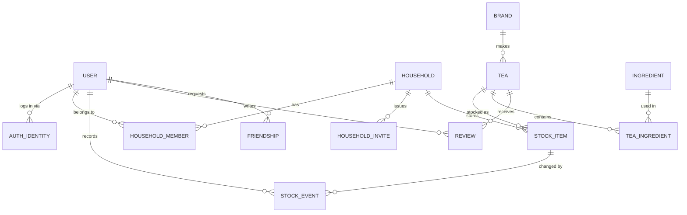

# Herbatka — Work Plan

A tea tracker: rate teas, know what's in them, know how much is left in the house,
and see what your friends are drinking.

Status: **M0–M6 done**. Next up: M7 — polish, then M8 — ship.

---

## 1. Locked decisions

| Decision | Choice | Why |
|---|---|---|
| Frontend | React 19 + TypeScript + Vite + Tailwind v4 | SPA, fast HMR, no SSR needs |
| Backend | Python 3.13 + FastAPI + SQLAlchemy 2.0 (async) + Alembic | Pydantic schemas generate the TS client for free |
| Database | PostgreSQL 17 | Relational domain, needs real joins and constraints |
| Stock ownership | **Shared households** — a first-class entity with members | "Check the stock of the tea in households" taken literally |
| Friends | Separate graph from households; drives review visibility only | A flatmate and a friend are different relationships |
| Auth | Email + password now, **OAuth-ready identity table from day one** | Adding Google later is a new row type, not a migration rewrite |
| Package mgmt | `uv` (Python), `npm` (Node) | `uv` is already installed; `pnpm` is not |

### Two relationships, deliberately not merged

This is the single most important modelling call in the app:

- **Household** = *who shares the physical tin*. Write access to stock. Small, stable, mutual by construction.
- **Friendship** = *whose taste you care about*. Read access to reviews and shelves. Large, loose, request/accept.

Merging them would mean either your flatmate sees your reviews as a "friend" whether
you like it or not, or your friends can decrement your gunpowder green. Keeping them
apart costs one extra table and removes an entire class of permission bug.

---

### Port allocation — the `1731x` block

Nothing here may use a default port. Opik alone occupies 2181, 3306, 5473, 6379,
8080, 8081, 8123, 9000, 9001, 9080, 9090 plus its observability stack (3003, 4317,
4318, 5140, 8888, 13133, 14317, 14318, 16686, 55679), and it is often running while
you work on this. So Herbatka gets a private contiguous block, verified free:

| Service | Port | Notes |
|---|---|---|
| Web (Vite dev server) | **17310** | `server.port` pinned, `strictPort: true` |
| API (FastAPI / uvicorn) | **17311** | Vite proxies `/api` here |
| PostgreSQL | **17312** | host-side only; in-network it stays 5432 |
| Adminer | **17313** | optional, behind a compose profile |
| Reserved | 17314–17319 | Redis, MinIO, mailhog if they ever land |

**Convention for `~/pet-projects`:** each project takes one decade in `173xx`.
Herbatka is `1731x`; the next project takes `1732x`, and so on. Two pet projects and
Opik can then all run at once without a single collision.

Two rules that make this stick:

- `strictPort: true` in `vite.config.ts`. Without it Vite silently hops to the next
  free port when 17310 is busy, and you spend twenty minutes wondering why the proxy
  broke.
- Ports are read from `.env` in exactly one place (`docker-compose.yml` and
  `app/core/config.py`), never hardcoded in a second file.

Container-internal ports stay at their defaults — Postgres listens on 5432 *inside*
the compose network, and only the host-side mapping is 17312. Remapping inside the
network buys nothing and confuses every tool that assumes the default.

---

## 2. Repo layout

```
herbatka/
├── docker-compose.yml         # postgres + adminer for local dev
├── .env.example
├── Makefile                   # make dev / make test / make migrate / make seed
├── api/
│   ├── pyproject.toml
│   ├── alembic.ini
│   ├── alembic/versions/
│   ├── app/
│   │   ├── main.py
│   │   ├── core/              # config, security, password hashing, deps
│   │   ├── db/                # engine, session, Base
│   │   ├── models/            # SQLAlchemy ORM
│   │   ├── schemas/           # Pydantic in/out
│   │   ├── api/v1/            # routers, one per feature
│   │   ├── services/          # business logic, kept out of routers
│   │   └── seed/              # ingredient + tea starter data
│   └── tests/
└── web/
    ├── package.json
    ├── vite.config.ts
    └── src/
        ├── app/               # router, query client, auth provider
        ├── features/          # auth catalog household stock reviews friends admin
        ├── components/ui/     # button, input, dialog, badge…
        └── lib/
            ├── api.ts         # fetch wrapper, refresh-on-401
            └── generated/     # OpenAPI → TS types, do not hand-edit
```

Routers stay thin: parse, authorize, delegate to `services/`, serialize. Every rule
worth testing lives in a service function that takes plain arguments, so tests never
need an HTTP client.

---

## 3. Data model



### Table notes

**`user`** — `id`, `email` (citext, unique), `display_name`, `avatar_url`,
`role` (`user` | `admin`), `created_at`. No password column; see below.

**`auth_identity`** — `user_id`, `provider` (`password` | `google`),
`provider_subject`, `password_hash` (nullable), unique on `(provider, provider_subject)`.
Password login is *one provider among several* rather than a special case. Adding
Google later inserts rows; it does not reshape `user`.

**`refresh_token`** — `user_id`, `token_hash`, `expires_at`, `revoked_at`, `user_agent`.
Hashed, never stored raw, so a DB leak can't be replayed as a login.

**`ingredient`** — `slug`, `name`, `category` (`leaf`/`herb`/`flower`/`spice`/`fruit`/`other`),
`is_caffeinated`, `description`. Admin-managed vocabulary.

**`brand`** — `name`, `country`, `website`.

**`tea`** — `slug`, `name`, `brand_id`, `tea_type` (green/black/oolong/puerh/white/herbal/rooibos/blend),
`origin_country`, `caffeine_level`, `description`, `image_url`,
`brew_temp_c`, `brew_seconds`, `grams_per_100ml`, `created_by`, `is_approved`.
`is_approved` lets users submit teas that an admin promotes into the shared catalog —
otherwise the catalog either stays empty or fills with junk.

**`tea_ingredient`** — `tea_id`, `ingredient_id`, `percentage` (nullable), `is_primary`.
A join table that *carries data*, which is why it's an explicit model and not a
plain many-to-many association.

**`household`** / **`household_member`** — member rows carry `role` (`owner` | `member`).
Every stock permission check is one indexed lookup on `(household_id, user_id)`.

**`household_invite`** — `code`, `invited_email` (nullable), `expires_at`, `accepted_at`.

**`stock_item`** — one physical tin: `household_id`, `tea_id`, `quantity_grams`,
`location` (free text: "kitchen shelf", "office"), `opened_at`, `best_before`,
`price_paid`, `purchased_at`, `notes`.

**`stock_event`** — append-only: `stock_item_id`, `user_id`, `delta_grams`,
`kind` (`purchase`/`brew`/`adjust`/`discard`), `occurred_at`, `note`.
`stock_item.quantity_grams` is a **cached** sum, recomputed in the same transaction
as each insert. You get "who drank the last of the oolong" and cheap reads at once —
an audit log with a materialised head.

**`review`** — `user_id`, `tea_id`, `score` (1–10), `body`, `brewed_at`,
subscores (`aroma`, `flavour`, `aftertaste`), unique on `(user_id, tea_id)`.
One standing opinion per person per tea, editable.

**`friendship`** — `requester_id`, `addressee_id`, `status`
(`pending`/`accepted`/`blocked`), `responded_at`. Store one row per pair with a
`CHECK (requester_id < addressee_id)`-style canonical ordering plus a unique
constraint, so A→B and B→A can't both exist.

### Permission matrix

| Action | Anonymous | User | Household member | Household owner | Admin |
|---|---|---|---|---|---|
| Browse approved teas / ingredients | ✅ | ✅ | ✅ | ✅ | ✅ |
| Submit a tea (unapproved) | ❌ | ✅ | ✅ | ✅ | ✅ |
| Create/edit ingredients, brands; approve teas | ❌ | ❌ | ❌ | ❌ | ✅ |
| Write a review | ❌ | ✅ | ✅ | ✅ | ✅ |
| Read a review | own+public | +friends' | +friends' | +friends' | all |
| View household stock | ❌ | ❌ | ✅ | ✅ | ✅ |
| Add/consume stock | ❌ | ❌ | ✅ | ✅ | ✅ |
| Invite/remove members, rename household | ❌ | ❌ | ❌ | ✅ | ✅ |

---

## 4. Milestones

Each milestone is a **vertical slice** — schema, API, and UI shipped together, so
there's a clickable app at every checkpoint rather than a backend with no face.

### M0 — Walking skeleton ✅
`docker-compose` with Postgres. FastAPI serving `/health`. Alembic wired with one
empty revision. Vite + React + Tailwind rendering a page that fetches `/health` and
shows it green. `make dev` starts everything.
**Done.** `make dev` brings up Postgres, migrations, API and web; the page shows a
green dot backed by a real `SELECT 1`. Typed client generated from OpenAPI via
`npm run types`.

### M1 — Identity ✅
`user`, `auth_identity`, `refresh_token`. Register / login / logout / `me`. Argon2
hashing. Short-lived access token in memory, refresh token in an httpOnly SameSite
cookie, silent refresh on 401 in `lib/api.ts`. `role` on the user; `require_admin`
dependency. Protected-route wrapper and a login page.
**Done.** `user_account` / `auth_identity` / `refresh_token`; Argon2id with
rehash-on-login; rotating refresh tokens with reuse detection; `CurrentUser` and
`AdminUser` dependency aliases; `make admin e=<email>`. Frontend: in-memory access
token, deduplicated silent refresh in `lib/api.ts`, `RequireAuth` / `RequireAdmin`,
login and register pages. 23 backend + 9 frontend tests. Verified in a browser:
register, hard-refresh while staying signed in, sign out, redirect back to `/login`.

### M2 — Catalog (read) + admin (write) ✅
`ingredient`, `brand`, `tea`, `tea_ingredient`. Public list/detail with pagination,
text search, and filters by type + ingredient. Admin CRUD behind `require_admin`.
Seed script with ~30 real ingredients and ~20 teas so the app is never empty.
**Done.** `brand` / `ingredient` / `tea` / `tea_ingredient`; public browse with search,
type/ingredient/brand filters and capped pagination, all working signed out; user
submissions land unapproved; admin CRUD and an approval queue behind a router-level
guard; 39 ingredients, 7 brands and 23 teas in an idempotent seed. Frontend filters
round-trip through the URL, so a filtered view is linkable and survives reload.
64 backend + 26 frontend tests. Verified in a browser: submit as a user → approve as
an admin → visible to a signed-out visitor; deleting an in-use ingredient shows the
server's 409 inline; a non-admin gets the 403 page.

### M3 — Households and stock ✅
`household`, `household_member`, `household_invite`, `stock_item`, `stock_event`.
Create a household, invite by code, accept, list members. Stock list with low-stock
highlighting; add a tin; a one-tap "brewed 5 g" that writes a `stock_event`. Every
endpoint gated on membership.
**Done.** `household` / `household_member` / `household_invite` / `stock_item` /
`stock_event`. Invite codes avoid ambiguous characters; the last owner cannot leave;
non-members get 404 rather than 403, so household ids cannot be probed. Quantity is not
patchable — every gram moves through the ledger, and `quantity_grams` is a cached sum
recomputed in the same transaction. Frontend: one-tap brew presets with optimistic
update and rollback on 409, `?low=1` in the URL, owner-only invites panel.
109 backend + 57 frontend tests. Verified in a browser: a member brews 5 g, the owner
sees the same number; brewing 500 g shows "Only 27.5 g left in that tin" and the
displayed amount returns.

### M4 — Ratings and reviews ✅
`review` with subscores. Write/edit your review from a tea page. Aggregate average and
count on tea cards and detail. Your own rating shown distinctly from the crowd average.
**Done.** `review` with a unique (user_id, tea_id) — one editable opinion per person
per tea, written with PUT. Scores 1–10 plus optional aroma/flavour/aftertaste. Averages
and the viewer's own score are folded into the tea list and detail in one grouped join,
not a correlated subquery per row; an unrated tea reports `null`, never 0. `/reviews/mine`
lists your own. 136 backend + 70 frontend tests.

Two things this milestone forced, both worth keeping in mind for M5:
- **Anything the response varies by must be in the query key.** The tea queries are keyed
  by viewer, or a signed-out response gets cached under the key a signed-in visitor reads.
- **Public routes must wait for auth to settle.** `/teas/:slug` is not behind
  `RequireAuth`, so on a cold load it fetched before the silent refresh finished and
  cached the anonymous answer. Found in a browser, not by a test; there is now a
  regression test that fails without the fix.

### M5 — Friends ✅
`friendship` with request/accept/block. Friend search by display name or email.
Review visibility widens to friends. A simple activity feed: friends' recent reviews
and newly-stocked teas.
**Done.** `friendship` stores one row per pair in a canonical order
(`user_a_id < user_b_id`), which makes A→B and B→A unrepresentable and forbids
befriending yourself for free. Ordering the pair discards "who asked", so
`requested_by_id` and `blocked_by_id` are separate: a pending request reads as outgoing
to one side and incoming to the other, and only the blocker can lift a block. A blocked
sender gets the same 404 as an unknown user, byte for byte. Search matches display names
partially but emails only in full, so the box cannot enumerate addresses. The feed is one
`UNION ALL` timeline with an id tiebreak, then two batched lookups.
169 backend + 90 frontend tests.

**Scope call:** the matrix above hints at friends-only reviews, but M4 shipped them
public and this milestone's acceptance criterion is about the feed, so reviews stayed
public. The feed carries friends' *reviews* plus tins added in households *you* belong
to — never a friend's shelf, which stays private to its members
(`test_a_friends_household_stock_stays_private`).

### M6 — Shops and buying ✅
Where tea comes from, and getting it onto a shelf.

`shop` (one model for both online and physical: an optional website, an optional
address/city/country) and `shop_listing` — a tea a shop sells, with pack size, price and
an outbound product link. Admin-managed with user submissions, the same approval queue
teas use.

**Buying records a purchase; it does not take payment.** You pick a listing, say how much
you bought and what you paid, and it lands on a household's shelf as a tin tagged with
the shop — which is what makes "a tea from a shop in a household" true. The outbound
"Buy at …" link sends you to the shop's own page for the actual transaction. Real
checkout was considered and rejected: payments, orders, fulfilment, refunds and tax are
a different application, not a milestone.

`stock_item` gains `shop_id`, and the purchase `stock_event` records the shop and price,
so the ledger keeps answering "where did this come from and what did it cost" — the data
a cost-per-cup or reorder feature would need later.

Images arrive here rather than in polish, because households need them now: one upload
endpoint writing to local disk in dev (S3-compatible later), used by households, shops
and teas alike. Validated on type and size, stored under a hashed name — never the
client's filename.

**Done.** 6 shops and 21 listings seeded across four currencies. 219 backend + 109
frontend tests. Verified in a browser: bought 50 g of Tie Guan Yin at Czajnik into Flat
3B, and the tin shows "Bought at Czajnik" with the price and a ledger entry. Household
pictures upload and render.

Two things this milestone taught, both found in a browser and neither by a test:
- **Vite proxies `/api` only.** Uploaded images live at `/media/…`, so every ``
  silently got `index.html` with a 200 — a broken picture and no error to explain it.
  `/media` is proxied now; in production the reverse proxy does that job.
- **Autogenerate wrote an unnamed foreign key for the third time.** `tests/test_migrations.py`
  now greps every revision for `create_foreign_key(None` and `drop_constraint(None`,
  because the failure is silent: `upgrade` succeeds, only `downgrade` breaks, and the
  failed downgrade makes the next upgrade a no-op.

### M7 — Polish
Tea images (local disk in dev, S3-compatible later). Empty and loading states across
the app. Dark mode. Mobile layout pass — the stock screen is a phone-in-the-kitchen
screen and should be designed as one. Basic a11y sweep.

### M8 — Ship
Dockerfiles for api and web. GitHub Actions: lint, typecheck, pytest, vitest, build.
Deploy to Fly.io or Railway with a managed Postgres and a migrate-on-release step.
**Done when:** pushing to `main` puts it online.

**Suggested order if time is short:** M0 → M1 → M2 → M3 is a genuinely useful app on
its own. M4–M5 are what make it social; M6–M7 are what make it real.

---

## 5. Cross-cutting

**Type safety across the wire.** FastAPI emits OpenAPI; `openapi-typescript` generates
`web/src/lib/generated/`. Committed, regenerated by `make types`, checked in CI. A
renamed Pydantic field then breaks the frontend build instead of production.

**Testing.** Backend: pytest + `httpx.AsyncClient` driving the real ASGI app
in-process. Postgres, not SQLite — the schema leans on citext, CHECK constraints and
cascades that SQLite silently would not enforce.

Two separate isolation problems, two mechanisms, and conflating them costs an
afternoon:

- *Test vs. test* — each test runs inside a transaction that is rolled back, with
  `join_transaction_mode="create_savepoint"` so the application's own `commit()` is
  genuinely exercised and still undone.
- *Test vs. dev data* — the suite uses its own `herbatka_test` database, created and
  migrated automatically on first run. Rollback alone does not help here: a test that
  registers `ada@example.com` fails the moment a real Ada exists in the dev database.

The test schema is built by running the actual migrations, so every run also proves the
migrations produce the schema the code expects.

Frontend: Vitest + Testing Library on the reducers, forms and auth plumbing, not on
every component.

**Money and mass.** Grams as `Numeric(8,2)`, never float. Prices as integer minor units
with a currency code.

**Timestamps.** `timestamptz`, UTC everywhere, formatted only at the edge.

**Migrations.** Every schema change is an Alembic revision, and each one is applied to
a scratch DB and rolled back once before it's committed.

---

## 6. Out of scope for v1

Barcode scanning · brew timers with notifications · shopping lists and reorder
suggestions · public profiles · comments on reviews · imports from vendor sites ·
i18n. Several are good v2 candidates — the stock ledger in particular already holds
the consumption history a reorder suggester would need.
